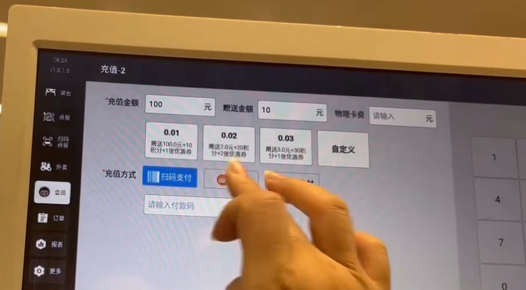
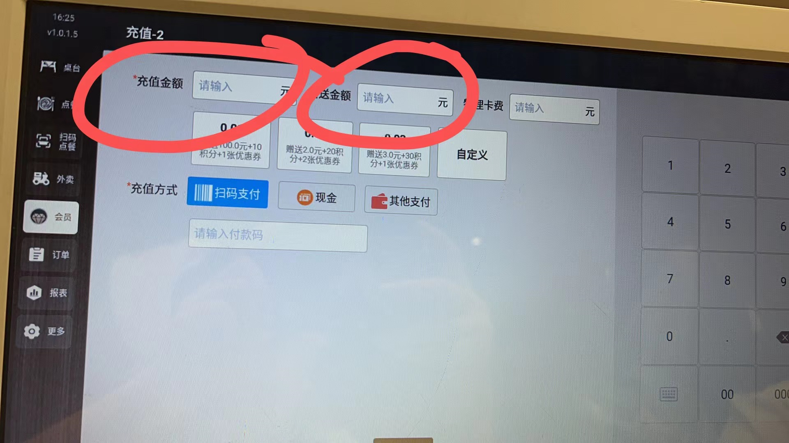
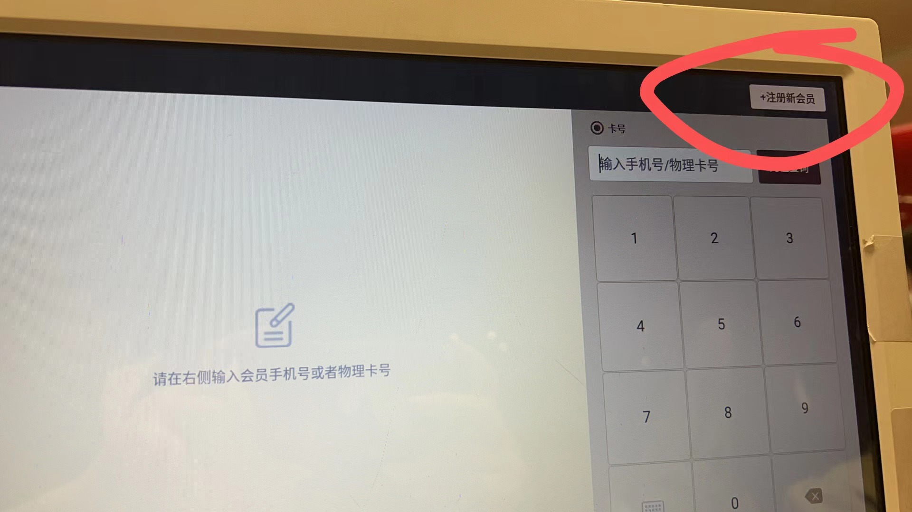
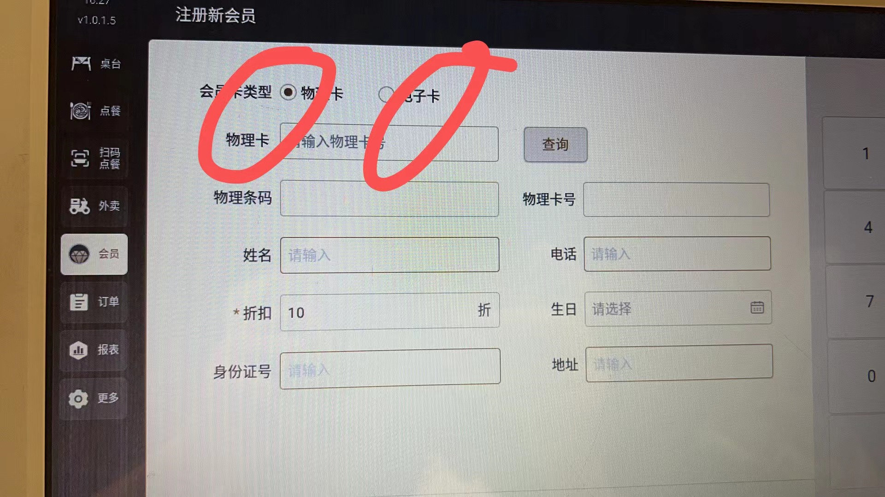
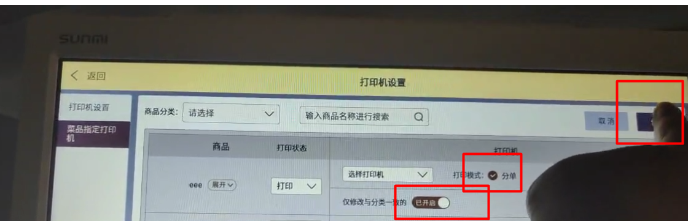

### 充值100送10麻烦发一下操作方法

先查询会员，然后填入充值金额，100  赠送金额   10 ，选择充值方式  。确认充值

### 会员怎么加入？

注册新会员——选择会员卡类型——依次填入信息

### 然后会员可以在他们自己的手机上操作的吗？

扫码下单用可以自己开通会员，然后进行冲值赠送

### 加了商品未显示

#### 王远平

上架了嘛 

> 上架了

@飘 您的账号可以提供下吗

我们这边登录后台帮您查看下

> 店铺帐号hlcyqtqxsmg-1
商家帐号hlcyqtqxsmg

### 我搞活动减现金五元，怎么设置

> 就是28的减到23怎么怎么设置？刚才直接点23支付不了

抹零掉5元呢

### 后厨的菜品指定打印机勾选了分单

> 保存后退出，打印仍是｜个号多碗面再菜品指定打印机点进去看，仍就是没有选中的

设置一次就可以了

就可以一直按照您设置的分单，打印下去

配置完成后需要同步一下数据

电脑上去操作

### 手机扫码点餐看不到估清数量，

> 手机下单不受库存限制 收银机点餐可以看到估清数量且正常

这个问题确实存在，前面已经有同事反馈研发了，在排期修复中 

> 主要问题是手机的丰收商小助APP的数据和收银机不能实现同步

 下期更新应该会修复掉