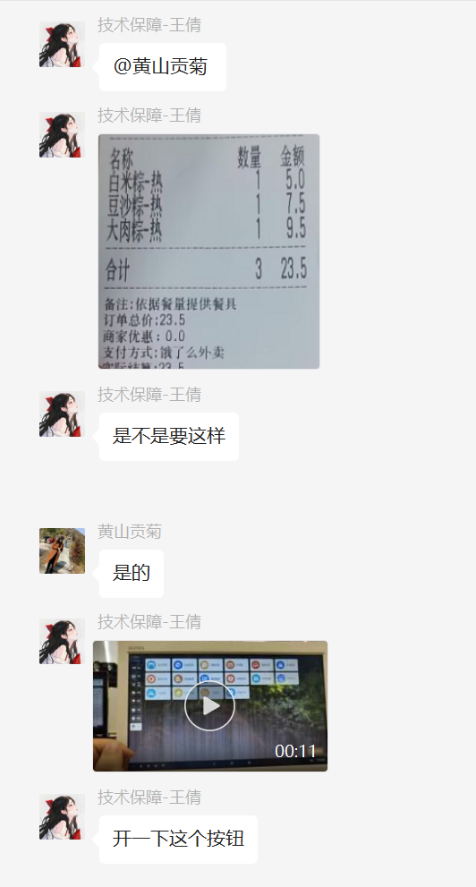

# 问题记录

1. 没有库存，进店铺账号。
2. 支付成功同步失败，上传订单。   
3. 餐饮设置支付密码。
   

### 线上储值

এ᭄ꦿ꯭大漠孤烟এ᭄ꫛꫀ:
您好，就是我们现在需要的会员功能就是顾客可以在线上自己储值，到店我们扫个会员就可以的那种。因为很多快餐类的餐厅没有时间输入手机号来在会员卡扣钱，更没有时间来为顾客充值。现在很多收银系统都有自己的会员功能，大部分都是微信小程序或者支付宝小程序上操作的

এ᭄ꦿ꯭大漠孤烟এ᭄ꫛꫀ:
这是今天安装的牛肉面馆的需求@技术保障-张云 

老佛爷:
这个需要小程序实现的呢

技术支持-刘霞:
线上充值系统现在是支持的，另外系统也可以接入微信小程序实现扫会员码扣款，首先要商家自己申请微信小程序。

এ᭄ꦿ꯭大漠孤烟এ᭄ꫛꫀ:
@技术保障-刘霞 找你们申请是吧

技术支持-刘霞:
这个要商家凭营业执照在微信小程序里申请，完成后联系我们，帮他把这个小程序接入我们的系统

### 商品估清-标准去不掉

### 外卖显示冷热

### 自动接单问题

### 登录不了

校验店铺编码

### 对公账户充卡

### 手机二维码扫码下单，可以看到商品库存

